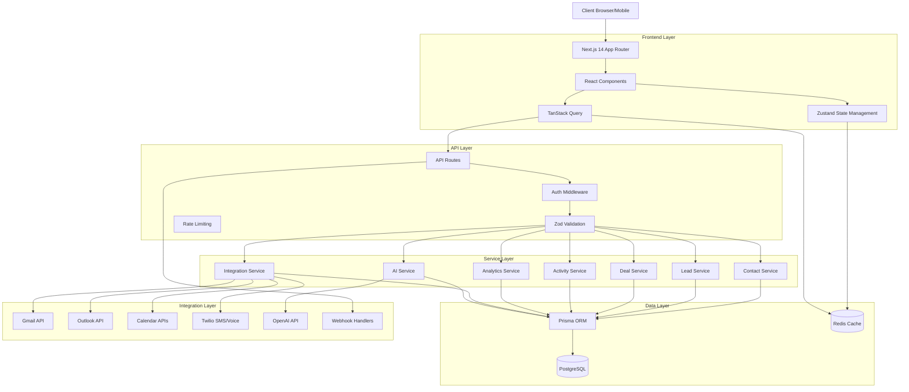
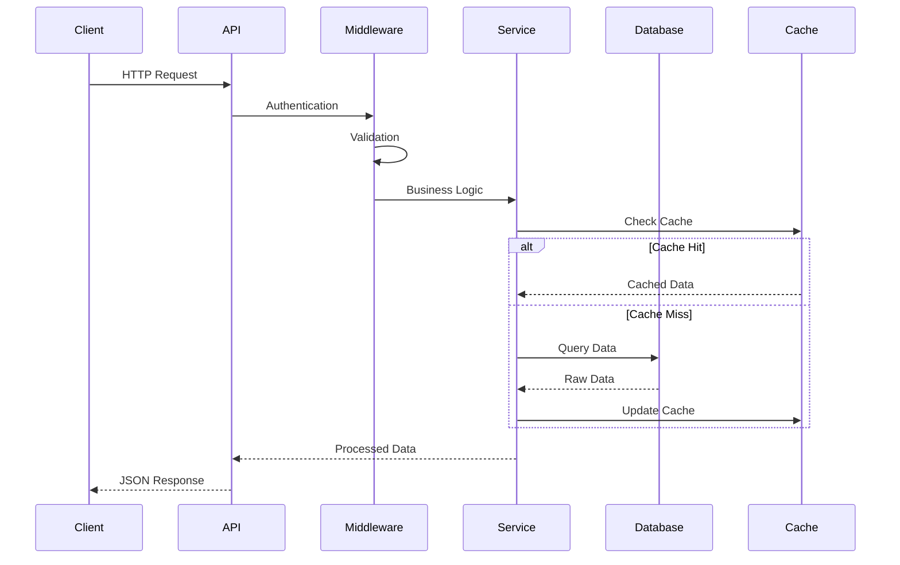
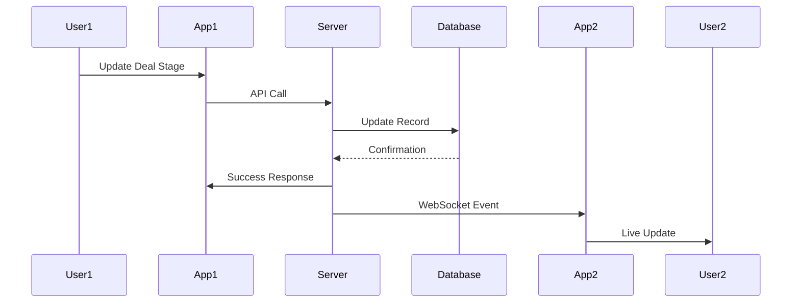
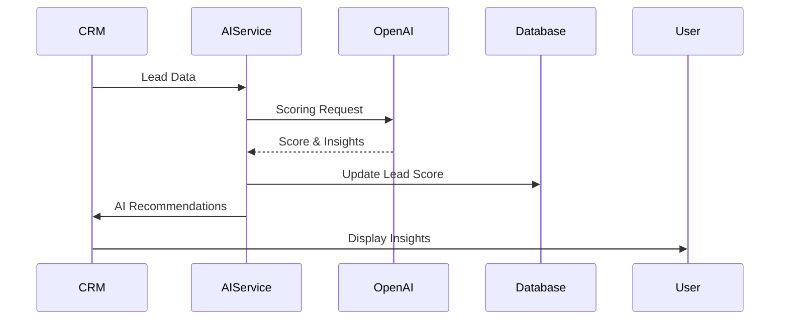

# RealmKit CRM - System Architecture

## Overview

The RealmKit CRM follows a **modern, AI-optimized layered architecture** designed for scalability, maintainability, and optimal productivity with AI coding assistants. The architecture prioritizes clear separation of concerns, type safety, and predictable patterns.

## Architecture Principles

### 1. AI-First Design
- **Predictable Patterns**: Consistent code structure for AI assistants
- **Self-Documenting**: Clear naming conventions and TypeScript interfaces
- **Context-Aware**: Comprehensive type definitions and documentation
- **Pattern Recognition**: Standardized file organization and naming

### 2. Scalable Architecture
- **Service Layer Pattern**: Business logic separation
- **Repository Pattern**: Data access abstraction
- **Event-Driven**: Async operations and real-time updates
- **Modular Design**: Feature-based organization

### 3. Type Safety First
- **Strict TypeScript**: Full type coverage with strict mode
- **Prisma Types**: Auto-generated database types
- **API Contracts**: Zod schemas for validation
- **Component Props**: Comprehensive interface definitions

## System Architecture Diagram



## Layer Details

### 1. Frontend Layer (Next.js 14 + React 18)

**Technology Stack:**
- Next.js 14 with App Router
- TypeScript 5 with strict mode
- React 18 with Suspense
- Tailwind CSS 3 + shadcn/ui
- Zustand for state management
- TanStack Query for server state

**Key Components:**
```
app/
├── (auth)/                 # Authentication pages
├── (dashboard)/           # Main CRM interface
│   ├── dashboard/         # Overview & analytics
│   ├── contacts/          # Contact management
│   ├── leads/             # Lead management
│   ├── deals/             # Sales pipeline
│   ├── activities/        # Activity tracking
│   └── settings/          # Configuration
└── api/                   # API routes
```

**State Management Strategy:**
- **Global State**: Zustand stores for user, settings, notifications
- **Server State**: TanStack Query for API data
- **Form State**: React Hook Form with Zod validation
- **UI State**: Local useState for component-specific state

### 2. API Layer (Next.js API Routes)

**Route Structure:**
```
api/
├── auth/                  # Authentication endpoints
├── contacts/              # Contact CRUD operations
├── leads/                 # Lead management
├── deals/                 # Deal/pipeline operations
├── activities/            # Activity tracking
├── analytics/             # Reporting endpoints
├── integrations/          # Third-party APIs
├── webhooks/              # Webhook handlers
└── ai/                    # AI-powered features
```

**Middleware Stack:**
1. **CORS Middleware**: Cross-origin request handling
2. **Auth Middleware**: JWT validation and user context
3. **Rate Limiting**: API abuse prevention
4. **Validation Middleware**: Zod schema validation
5. **Error Handling**: Standardized error responses
6. **Logging Middleware**: Request/response logging

### 3. Service Layer (Business Logic)

**Service Architecture:**
```typescript
// Example: Contact Service Interface
export interface ContactService {
  create(data: CreateContactInput): Promise<Contact>
  update(id: string, data: UpdateContactInput): Promise<Contact>
  findById(id: string): Promise<Contact | null>
  findMany(filters: ContactFilters): Promise<ContactList>
  delete(id: string): Promise<void>
  mergeDuplicates(primaryId: string, duplicateIds: string[]): Promise<Contact>
}
```

**Service Responsibilities:**
- **Contact Service**: Profile management, deduplication, segmentation
- **Lead Service**: Lead scoring, qualification, nurturing workflows
- **Deal Service**: Pipeline management, forecasting, stage progression
- **Activity Service**: Timeline tracking, task management, reminders
- **Analytics Service**: Reporting, metrics calculation, forecasting
- **Integration Service**: Third-party API coordination
- **AI Service**: Lead scoring, insights, automation

### 4. Data Layer (Prisma + PostgreSQL)

**Database Schema Design:**

**Core Entities:**
- `User`: System users with RBAC
- `Company`: Organizations and accounts
- `Contact`: Individual contact records
- `Lead`: Potential customer records
- `Deal`: Sales opportunities
- `Activity`: Interactions and communications
- `Task`: Action items and reminders

**Relationship Strategy:**
- **One-to-Many**: User → Contacts, Company → Contacts
- **Many-to-Many**: Contacts ↔ Deals, Users ↔ Deals
- **Polymorphic**: Activities can relate to any entity
- **Self-Referencing**: Contact hierarchies, Deal dependencies

**Performance Optimizations:**
- **Indexes**: Strategic indexing on frequently queried fields
- **Full-Text Search**: PostgreSQL full-text search capabilities
- **Pagination**: Cursor-based pagination for large datasets
- **Caching**: Redis caching for frequently accessed data

### 5. Integration Layer

**Integration Architecture:**
```typescript
export interface IntegrationProvider {
  name: string
  authenticate(credentials: any): Promise<AuthResult>
  sync(entityType: EntityType): Promise<SyncResult>
  webhook(payload: any): Promise<WebhookResult>
}
```

**Supported Integrations:**
- **Email**: Gmail, Outlook, Exchange
- **Calendar**: Google Calendar, Outlook Calendar
- **Communication**: Twilio SMS/Voice
- **AI**: OpenAI for intelligent features
- **Webhooks**: Real-time data synchronization

## Data Flow Patterns

### 1. Request Processing Flow



### 2. Real-time Updates Flow



### 3. AI Processing Flow



## Security Architecture

### 1. Authentication & Authorization

**NextAuth 5 Configuration:**
- JWT-based authentication
- Multiple providers (credentials, OAuth)
- Session management with Redis
- Role-based access control (RBAC)

**Permission System:**
```typescript
enum Permission {
  CONTACT_VIEW = 'contact:view',
  CONTACT_EDIT = 'contact:edit',
  CONTACT_DELETE = 'contact:delete',
  DEAL_VIEW = 'deal:view',
  DEAL_EDIT = 'deal:edit',
  ANALYTICS_VIEW = 'analytics:view',
  ADMIN_ACCESS = 'admin:access'
}
```

### 2. Data Security

**Encryption Strategy:**
- **At Rest**: PostgreSQL encryption + application-level encryption for sensitive fields
- **In Transit**: TLS 1.3 for all communications
- **API Keys**: Encrypted storage with rotation capabilities
- **Passwords**: bcrypt with salt rounds

**Privacy Compliance:**
- GDPR data processing records
- Data retention policies
- Right to deletion implementation
- Audit logging for compliance

## Performance & Scalability

### 1. Caching Strategy

**Multi-Layer Caching:**
```typescript
// Service layer caching
const getCachedContact = async (id: string): Promise<Contact> => {
  const cacheKey = `contact:${id}`
  
  // L1: Memory cache (service instance)
  if (memoryCache.has(cacheKey)) {
    return memoryCache.get(cacheKey)
  }
  
  // L2: Redis cache (shared)
  const cached = await redis.get(cacheKey)
  if (cached) {
    const contact = JSON.parse(cached)
    memoryCache.set(cacheKey, contact)
    return contact
  }
  
  // L3: Database query
  const contact = await database.findContact(id)
  await redis.setex(cacheKey, 300, JSON.stringify(contact))
  memoryCache.set(cacheKey, contact)
  
  return contact
}
```

### 2. Database Optimization

**Query Optimization:**
- Connection pooling with PgBouncer
- Read replicas for analytics queries
- Materialized views for complex reports
- Background jobs for heavy operations

**Indexing Strategy:**
```sql
-- Contact search optimization
CREATE INDEX idx_contacts_search ON contacts 
USING gin(to_tsvector('english', name || ' ' || email || ' ' || company));

-- Activity timeline optimization
CREATE INDEX idx_activities_entity_date ON activities (entity_type, entity_id, created_at DESC);

-- Deal pipeline optimization  
CREATE INDEX idx_deals_stage_value ON deals (stage, value DESC, updated_at);
```

### 3. Real-time Architecture

**WebSocket Implementation:**
- Socket.io for real-time features
- Redis adapter for multi-server scaling
- Room-based subscriptions
- Automatic reconnection handling

## Monitoring & Observability

### 1. Logging Strategy

**Structured Logging:**
```typescript
const logger = createLogger({
  level: process.env.LOG_LEVEL || 'info',
  format: winston.format.combine(
    winston.format.timestamp(),
    winston.format.errors({ stack: true }),
    winston.format.json()
  ),
  transports: [
    new winston.transports.File({ filename: 'logs/error.log', level: 'error' }),
    new winston.transports.File({ filename: 'logs/combined.log' }),
    new winston.transports.Console()
  ]
})
```

### 2. Metrics & Analytics

**Key Metrics:**
- API response times
- Database query performance
- User engagement metrics
- Error rates and patterns
- Real-time active users

### 3. Health Checks

**Endpoint Monitoring:**
```typescript
export async function GET() {
  const checks = await Promise.allSettled([
    checkDatabase(),
    checkRedis(),
    checkExternalAPIs()
  ])
  
  const status = checks.every(check => check.status === 'fulfilled') 
    ? 'healthy' : 'degraded'
    
  return Response.json({ status, checks, timestamp: new Date().toISOString() })
}
```

## Development Guidelines

### 1. Code Organization

**Feature-Based Structure:**
```
features/
├── contacts/
│   ├── components/
│   ├── services/
│   ├── types/
│   └── utils/
├── deals/
│   ├── components/
│   ├── services/
│   ├── types/
│   └── utils/
└── shared/
    ├── components/
    ├── hooks/
    └── utils/
```

### 2. Type Safety

**Comprehensive TypeScript:**
```typescript
// API route type safety
export async function POST(request: Request): Promise<Response> {
  const body = await request.json()
  const validatedData = CreateContactSchema.parse(body)
  
  const contact = await contactService.create(validatedData)
  
  return Response.json(contact, { status: 201 })
}
```

### 3. Testing Strategy

**Test Pyramid:**
- **Unit Tests**: Service layer logic (70%)
- **Integration Tests**: API endpoints (20%)
- **E2E Tests**: Critical user flows (10%)

## Deployment Architecture

### 1. Container Strategy

**Multi-Stage Docker:**
- Build stage: Dependencies and compilation
- Production stage: Minimal runtime image
- Development stage: Hot reload support

### 2. Infrastructure

**Recommended Deployment:**
- **Application**: Vercel/Railway for Next.js
- **Database**: PostgreSQL on RDS/Supabase
- **Cache**: Redis on Upstash/ElastiCache
- **Files**: S3/Cloudinary for uploads
- **Monitoring**: DataDog/New Relic

### 3. CI/CD Pipeline

**GitHub Actions Workflow:**
1. Code quality checks (ESLint, Prettier)
2. Type checking (TypeScript)
3. Unit test execution
4. Integration test suite
5. Build verification
6. Deployment to staging
7. E2E test execution
8. Production deployment

This architecture provides a solid foundation for building a scalable, maintainable CRM system while optimizing for AI-assisted development workflows.